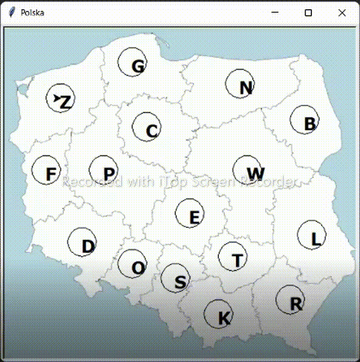

**About project**

Used technologies:
- Python
- turtle module. 

It was one of tasks in my collegue course but I modified it a little bit and added more functionalities.

I am trying to visualize some graph algorithms on Poland map. Vertexes and edges represent voivodeships and distance beetwen them (in km).

Example results:

